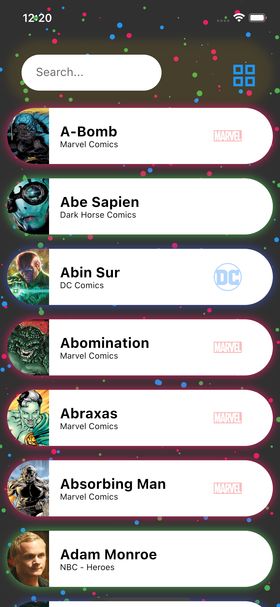
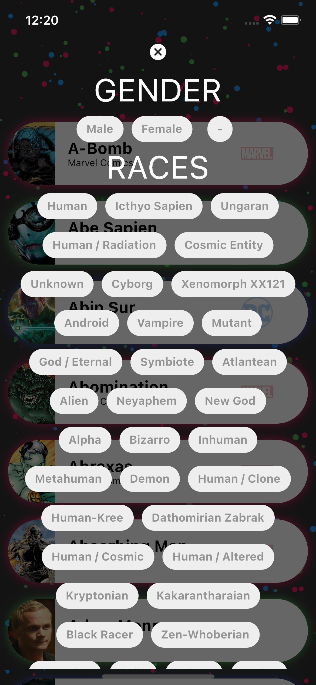
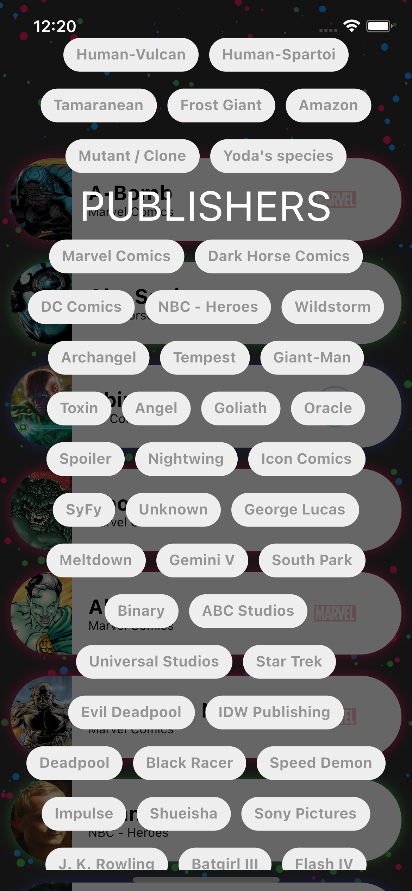
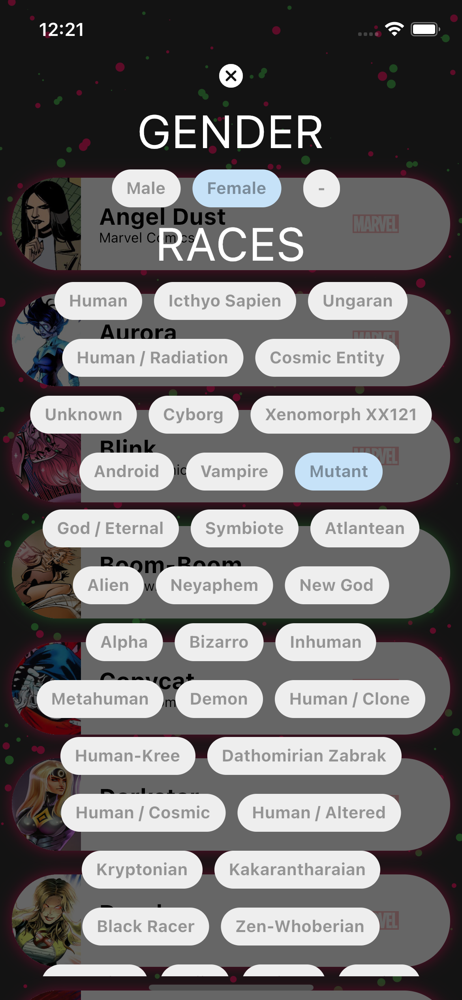
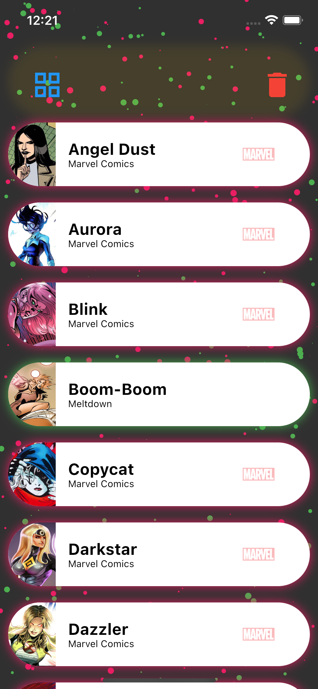
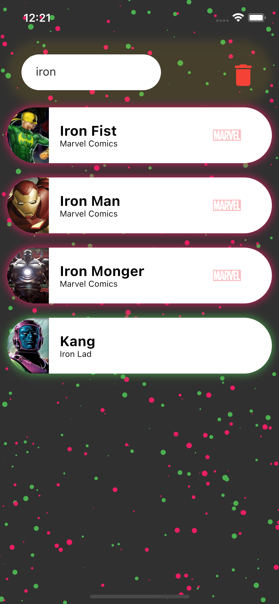
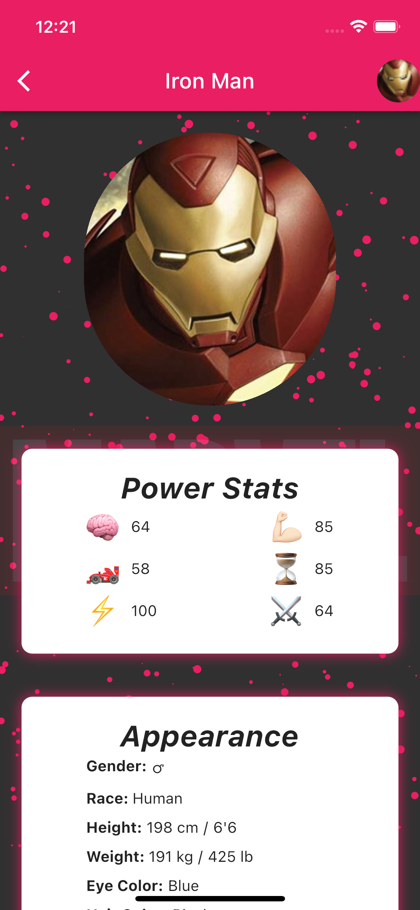
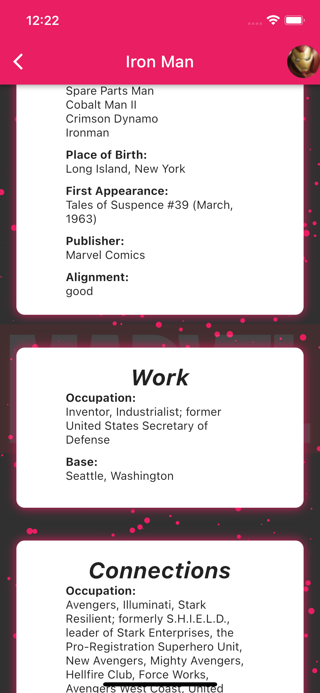
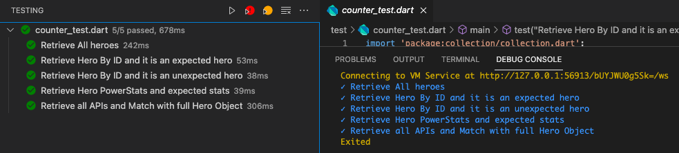

# rd_test_flutter_heroes

A new Flutter project.

## Observations

* Main endpoint `/all.json` contains all heroes details (powerstats, biography, etc.), however I added all APIs for specific features like powerstats, biography, etc. So it is a complete set of the provided task using all the API features using a wrapped service with Futures and parsable objects from Json to Dart object with good optimisations.

### Filters

- Gender

- Race

- Publishers

### Details

- Using wrapped services

- Each object is a card of description

- Small animations

- Added custom level system

- Non Marvel or DC publishers are green Publishers with no publisher image

### Easter Eggs

- If you make a filter and the result contains only specific publishers, background animated particles will match filtered publishers only

### Screenshots

    
    
    
    

    
    
    
    

### Unit tests (see: test/counter_test.dart)

